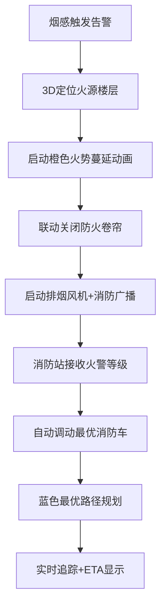
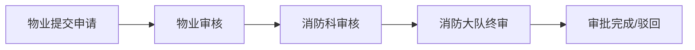

## 1. 产品概述

3D智慧城市消防应急与建筑消防设施监控可视化平台，基于Three.js构建沉浸式三维城市消防场景，实现高层建筑消防设施实时监控、火警智能联动、消防资源调度与应急疏散引导一体化管理。

- 核心用途：城市级消防态势感知、应急指挥决策辅助、日常消防运维管理
- 目标用户：消防指挥中心人员、消防巡查员、物业管理人员
- 产品价值：提升火警响应效率30%+，降低设施运维成本，保障城市消防安全

---

## 2. 核心功能

### 2.1 用户角色与权限

| 角色 | 登录方式 | 核心权限 |
|------|----------|----------|
| 物业人员 | 人脸识别登录 | 查看设施状态、提交装修审批、查看疏散路径 |
| 消防巡查员 | 人脸识别登录 | 设施巡检、工单处理、巡查机器人管理 |
| 指挥中心 | 人脸识别登录 | 全部权限、火警指挥、消防车调度、数据导出 |

### 2.2 功能模块

1. **3D城市场景模块**：高层建筑群、消防站、消防水源、防火分区、指挥中心可视化
2. **消防设施监控模块**：烟感状态、喷淋系统、消防栓水压实时可视化
3. **火警联动模块**：火源定位、3D火势蔓延模拟、防火卷帘/排烟/广播联动
4. **消防调度模块**：消防车最优路径规划、实时追踪、ETA预估
5. **疏散引导模块**：绿色箭头逃生路径、楼层疏散动画
6. **巡查机器人模块**：自动巡检、异常检测与拍照上传
7. **装修审批模块**：物业→消防科→消防大队三级电子会签
8. **数据报表模块**：消防日报Excel导出、统计图表

### 2.3 页面详情

| 页面名称 | 模块名称 | 功能描述 |
|----------|----------|----------|
| 登录页 | 人脸识别登录 | 人脸扫描动画、角色选择、登录日志记录 |
| 指挥中心大屏 | 3D场景主视图 | 城市三维模型、建筑信息浮层、状态指示牌 |
| 指挥中心大屏 | 设施监控面板 | 烟感/喷淋/水压状态卡片、故障告警列表 |
| 指挥中心大屏 | 火警联动控制 | 火警触发按钮、火势蔓延、联动设备状态 |
| 指挥中心大屏 | 消防调度面板 | 消防车列表、路径规划、实时位置追踪 |
| 指挥中心大屏 | 功能侧栏 | 疏散引导/机器人/审批/报表快捷入口 |
| 装修审批页 | 审批流程卡片 | 三级会签进度可视化、审批操作按钮 |
| 报表导出页 | 日期选择+导出 | 日期范围选择、Excel一键导出 |

---

## 3. 核心业务流程

### 火警应急流程

### 装修审批流程

---

## 4. 用户界面设计

### 4.1 设计风格
- **主色调**：深空蓝 `#0a1628`（背景）+ 消防红 `#ff4444`（告警）+ 科技蓝 `#00d4ff`（信息）+ 生命绿 `#00ff88`（安全）
- **辅色调**：警示橙 `#ff8800`、电力黄 `#ffcc00`
- **整体风格**：赛博朋克·指挥中心大屏风，深色背景+霓虹发光边框+HUD仪表盘
- **按钮风格**：半透明玻璃拟态+霓虹发光边框，hover态发光增强
- **字体**：主标题使用 `Orbitron`（科技感等宽），正文使用 `Noto Sans SC`
- **布局**：中心3D场景 + 四周浮动信息面板 + 底部状态栏
- **动效**：所有状态变化伴随脉冲发光、扫描线、粒子扩散

### 4.2 页面设计概览

| 页面名称 | 模块名称 | UI元素 |
|----------|----------|--------|
| 登录页 | 人脸识别框 | 圆形扫描框+绿色进度环+角色卡 |
| 指挥中心 | 顶部状态栏 | 时间/角色/在线状态/告警计数徽章 |
| 指挥中心 | 左侧面板 | 建筑列表+设施状态卡片+告警滚动列表 |
| 指挥中心 | 中心3D区 | Three.js场景+建筑高亮+路径动画+火势粒子 |
| 指挥中心 | 右侧面板 | 调度控制+审批进度+机器人状态 |
| 指挥中心 | 底部面板 | 统计图表+快捷操作栏+功能切换Tab |

### 4.3 响应式
- Desktop-First：主分辨率 1920×1080 指挥中心大屏优化
- 次要适配：1366×768 笔记本自适应
- 触控优化：底部操作栏增大点击区域

### 4.4 3D场景指导
- **环境**：夜间城市霓虹场景，雾效模拟大气透视，HDR环境贴图反射
- **灯光**：定向月光+建筑窗户自发光+消防设施点光源（红色脉冲）
- **相机**：默认45°俯视城市，支持鼠标拖拽平移/滚轮缩放/点击建筑聚焦
- **构成**：中心超高层地标建筑+周边建筑群+网格化城市道路+地面发光消防通道标识
- **交互**：点击建筑弹出楼层信息面板，悬停高亮建筑轮廓，双击飞入建筑内部
- **后处理**：Bloom泛光（状态指示灯）、FXAA抗锯齿、轻微Vignette暗角
- **性能预算**：模型面数<50万，Draw Call<200，稳定60fps
