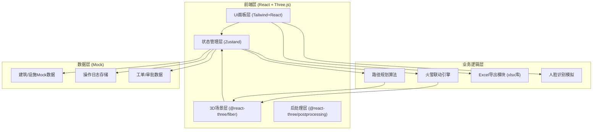

## 1. 架构设计



---

## 2. 技术栈说明

| 层级 | 技术选型 | 版本 | 用途 |
|------|----------|------|------|
| 框架 | React | 18.x | UI组件化开发 |
| 构建 | Vite | 5.x | 快速构建与HMR |
| 语言 | TypeScript | 5.x | 类型安全 |
| 样式 | TailwindCSS | 3.x | 原子化CSS |
| 3D引擎 | three | ^0.160 | WebGL三维渲染 |
| 3D桥接 | @react-three/fiber | ^8.15 | React声明式Three.js |
| 3D工具集 | @react-three/drei | ^9.92 | 辅助组件/控制器 |
| 3D后处理 | @react-three/postprocessing | ^2.15 | Bloom/抗锯齿 |
| 状态 | zustand | ^4.4 | 轻量状态管理 |
| 图标 | lucide-react | ^0.294 | 图标库 |
| 路由 | react-router-dom | ^6.20 | 多页路由 |
| Excel | xlsx | ^0.18.5 | Excel导出 |

---

## 3. 路由定义

| 路由路径 | 页面组件 | 用途 |
|----------|----------|------|
| `/login` | LoginPage | 人脸识别登录页 |
| `/dashboard` | DashboardPage | 指挥中心主大屏（默认路由） |
| `/approval` | ApprovalPage | 装修审批进度页 |
| `/reports` | ReportsPage | 报表导出页 |

---

## 4. 核心状态模型（Zustand Store）

```typescript
// 用户状态
interface UserState {
  currentUser: {
    id: string;
    name: string;
    role: 'property' | 'inspector' | 'command';
    loginTime: Date;
  } | null;
  loginLog: LoginRecord[];
}

// 建筑设施状态
interface BuildingState {
  buildings: Building[];           // 所有建筑
  fireAlarms: FireAlarm[];         // 当前火警
  workOrders: WorkOrder[];         // 维修工单
  dispatchStatus: DispatchStatus;  // 调度状态
  evacuationActive: boolean;       // 疏散是否激活
  robotStatus: RobotStatus;        // 机器人状态
  approvals: ApprovalItem[];       // 审批事项
}

// 单个建筑
interface Building {
  id: string;
  name: string;
  floors: number;
  position: [number, number, number];
  facilities: FloorFacility[];
  fireDoors: FireDoor[];
}

// 楼层设施
interface FloorFacility {
  floor: number;
  smokeDetector: { status: 'normal' | 'alarm' | 'fault' };
  sprinkler: { status: 'normal' | 'active' | 'fault' };
  hydrantPressure: number; // MPa
}
```

---

## 5. 项目目录结构

```
src/
├── components/
│   ├── Login/            # 登录相关组件
│   ├── Scene3D/          # 3D场景组件
│   │   ├── CityScene.tsx        # 主城市场景
│   │   ├── BuildingModel.tsx    # 建筑模型
│   │   ├── FireStation.tsx      # 消防站
│   │   ├── FireTruck.tsx        # 消防车
│   │   ├── FireEffect.tsx       # 火势粒子特效
│   │   ├── PathLine.tsx         # 路径动画
│   │   └── EvacuationPath.tsx   # 疏散引导箭头
│   ├── Panels/           # 信息面板组件
│   │   ├── LeftPanel.tsx        # 设施监控
│   │   ├── RightPanel.tsx       # 调度控制
│   │   ├── BottomPanel.tsx      # 状态栏
│   │   ├── AlarmList.tsx        # 告警列表
│   │   └── FacilityCard.tsx     # 设施状态卡
│   ├── Approval/         # 审批组件
│   └── Reports/          # 报表组件
├── store/
│   └── useFireStore.ts   # Zustand全局状态
├── data/
│   └── mockData.ts       # 建筑/设施Mock数据
├── utils/
│   ├── pathfinding.ts    # 路径规划算法
│   ├── excelExport.ts    # Excel导出
│   └── helpers.ts        # 工具函数
├── pages/
│   ├── LoginPage.tsx
│   ├── DashboardPage.tsx
│   ├── ApprovalPage.tsx
│   └── ReportsPage.tsx
├── App.tsx
├── main.tsx
└── index.css
```

---

## 6. 核心算法说明

### 6.1 最优路径规划（A*简化版）
- 将城市道路抽象为网格图
- 启发函数：曼哈顿距离
- 路径权重：道路通畅度 + 距离 + 拥堵系数
- 渲染：Three.js TubeGeometry + 流动材质动画

### 6.2 火势蔓延模拟
- 基于楼层扩散模型：火源层 → 上下层概率扩散
- 可视化：橙色粒子系统 + 楼层Mesh颜色渐变
- 参数：蔓延速度/范围由火警等级控制

### 6.3 Excel日报结构
```
Sheet1: 消防日报
├── 日期范围
├── 火警统计表（次数/等级/响应时间）
├── 设施故障率（烟感/喷淋/消防栓）
├── 消防车出警记录表
└── 未完成工单列表
```
